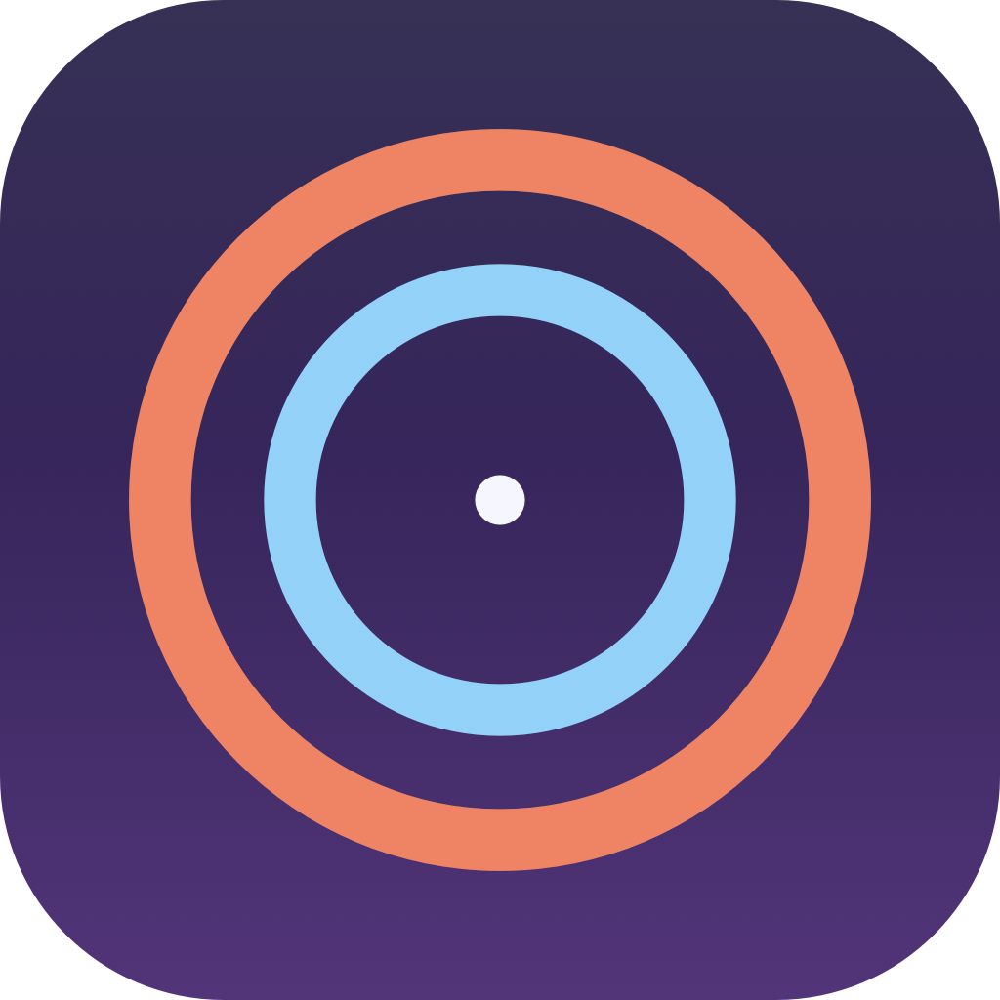

<p align="center">
  
</p>

# ParamClaudeBar

A native macOS menu bar app for keeping an eye on your Claude usage at a glance — and getting a quiet nudge before you hit a limit.

<p align="center">
  
</p>


## Features

- **Dual-ring menu bar icon** — outer ring tracks the 7-day window, inner ring tracks the 5-hour window. Each ring shifts colour as it gets closer to its limit.
- **Configurable display mode** — icon, icon + percentage, or just the percentage.
- **Click for the full picture** — current usage for both windows, per-model breakdown (Opus / Sonnet) when present, extra usage in USD if your account has it, plus a 60-minute pace sparkline and a one-line burn-rate summary.
- **Burn-rate projection** — once enough history is collected, ParamClaudeBar fits a line to the last 30 minutes of usage and tells you when you'd hit the 5-hour limit at the current pace, or that you're on track to coast.
- **History chart** — 1h / 6h / 1d / 7d / 30d range buttons with hover tooltip, tucked behind a `History` disclosure so it stays out of the way until you want it.
- **Notifications** — independent **Warning** (default 75%) and **Critical** (default 90%) thresholds, a **Burn-rate** alert when the 5-hour projection lands within 30 minutes, and an optional **Reset** notification. All debounced per window so a single crossing fires exactly once.
- **Polls every minute by default**, configurable to 1m / 2m / 5m / 15m. Pauses on system sleep, resumes on wake.
- **Sign in once, persistent auth** — OAuth with Claude, refresh tokens kept across launches.
- **Auto-updates via Sparkle.** Tag-driven release flow signs the new build and points your install at it.

## Install

1. Download `ParamClaudeBar.dmg` from the [latest release](https://github.com/M45K3D/ParamClaudeBar/releases/latest).
2. Open the disk image and drag `ParamClaudeBar.app` into `Applications`.
3. Launch from `/Applications`. macOS will require **right-click → Open** the first time, since the build is ad-hoc signed (not Apple-developer-signed).

On first launch the onboarding window walks you through signing in with Claude and granting notification permission. After that, just look for the dual-ring icon in your menu bar.

## Settings

Click the menu bar icon → **Settings…** (or press ⌘,):

- **General** — launch at login, polling interval, menu bar display mode, burn-rate hint.
- **Appearance** — theme (system / light / dark), monochrome icon.
- **Notifications** — warning / critical thresholds, burn-rate alert, reset alert, "Send Test Notification" button.
- **Account** — current sign-in state, last successful poll, sign out.
- **About** — version, "Check for Updates", upstream credit.

## Data storage

ParamClaudeBar keeps everything local in `~/Library/Application Support/ParamClaudeBar/`:

| File | Mode | Purpose |
|------|------|---------|
| `credentials.json` | `0600` | OAuth access + refresh token, expiry, scopes. |
| `history.json` | `0644` | Usage history for the chart (30-day retention, flushed every 5 minutes and on quit). |

If you previously ran the upstream `claude-usage-bar`, contents of `~/.config/claude-usage-bar/` are copied across on first launch and the legacy directory is left in place so you can clean it up manually.

Nothing is sent anywhere except the Anthropic API.

## Build from source

Requires Xcode 15+ / Swift 5.9+ on macOS 14 (Sonoma) or later.

```sh
git clone https://github.com/M45K3D/ParamClaudeBar.git
cd ParamClaudeBar
make app            # build the .app bundle
make dmg            # build the drag-to-Applications disk image
make install        # build + copy to /Applications
make zip            # build + zip + verify (used for Sparkle releases)
```

Local source builds intentionally leave Sparkle's feed URL unset, so a hand-built copy doesn't auto-update against the published binaries.

## Releasing (maintainer notes)

Releases are tag-driven. Pushing a `v*` tag triggers the GitHub Actions workflow that builds the bundle, produces ZIP and DMG artifacts, verifies them, generates a signed Sparkle appcast, and deploys it to GitHub Pages.

```sh
git tag v1.0.0
git push origin v1.0.0
```

One-time repository setup: enable GitHub Pages with source `GitHub Actions` and add a `SPARKLE_PRIVATE_KEY` repository secret. The corresponding public EdDSA key lives in `macos/Resources/Info.plist` under `SUPublicEDKey`.

The appcast feed used by release builds is:

```text
https://m45k3d.github.io/ParamClaudeBar/appcast.xml
```

## Credits

Forked from [Blimp-Labs/claude-usage-bar](https://github.com/Blimp-Labs/claude-usage-bar) under BSD-2-Clause. The upstream project provided the OAuth flow, polling loop, and history persistence that ParamClaudeBar builds on. The visual identity, ring icon, settings infrastructure, burn-rate calculator, notifications rework, onboarding flow, and storage migration are new in this fork.

## License

[BSD 2-Clause](LICENSE) — inherited from upstream.
